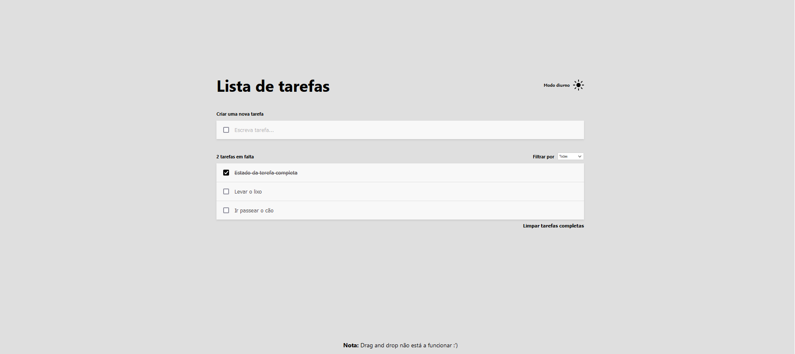

# Todo app solution

## Table of contents

- [Overview](#overview)
  - [The challenge](#the-challenge)
  - [Screenshot](#screenshot)
- [My process](#my-process)
  - [Built with](#built-with)

## Overview

### The challenge

Users should be able to:

- Done View the optimal layout for the app depending on their device's screen size
- Done See hover states for all interactive elements on the page
- Done Add new todos to the list
- Done Mark todos as complete
- Done Delete todos from the list
- Done Update todos from the list (extra functionality)
- Done Filter by all/active/complete todos
- Done Clear all completed todos
- Done Toggle light and dark mode
- Done Bonus: The todos data should be stored through refreshes.
- ❌Bonus: Drag and Drop

### Screenshot

### Firefox Screenshot

## My process

For this challenge my initial priority was to to create an identical html layout and ajust it with my custom css properties.
Before jumping into TypeScript i started to refactor the project structure and the code , by building new Folders and separating into smaller components.
Since it was a typescript project,i was able to create and work with interfaces which allowed me to define the shape of the objects.This helps ensure that objects conform to a specific structure throughout your codebase. , plus it gives a good code readability and reusability.
For the functionality, i started to do the AddTodo Task, followed by removeTask & Edit Task ,filters.
The Light mode and Dark mode toggles are functioning but it could be done better.
To be responsive in different device screen size i used flexbox layout.
By avoiding external libraries it made the project even more challenging and made me consolidate more of my skills and learned more about typescript.

### Built with

- Semantic HTML5 markup
- CSS custom properties
- [React](https://reactjs.org/) - JS library
